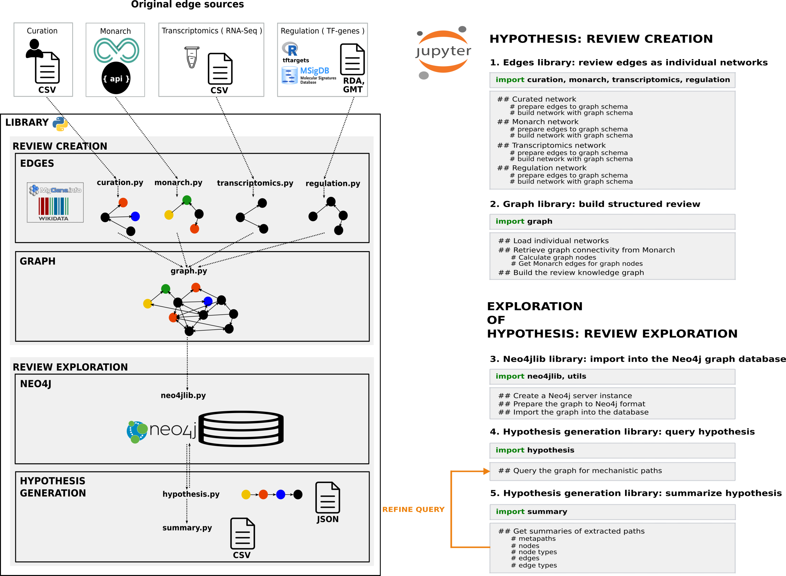

# BioKnowledge reviewer library
This is a Python library to create structured reviews integrating knowledge and data from different types. We built a library for a dynamic, interactive and evolving network construction and hypothesis generation process. It is designed to build the review network based on the research question hypothesis. In Figure workflow we show the workflow of network-based review and hypothesis generation process. 

The library was developed and tested on Ubuntu 18.04.

##### Prerequisites

* Python 3 (we used Python 3.6.4). We provide a [requirements.txt](https://github.com/NuriaQueralt/bioknowledge-reviewer/blob/master/requirements.txt) file to set a virtual environment to run the library for the creation of structured reviews around the NGLY1 Deficiency. The library + the environment runs without problems in an Ubuntu 18.04 distribution.

* Neo4j Community Server Edition 3.5 (we used Neo4j v3.5.6). The server configuration in `conf/neo4j.conf` file has to be:
 
   * authentication disabled (uncomment the following line)
   ~~~~
   dbms.security.auth_enabled=false
   ~~~~
   
   * accept non-local connections (uncomment the following line)
   ~~~~
   dbms.connectors.default_listen_address=0.0.0.0
   ~~~~
   
   * default ports (uncomment the following lines)
   ~~~~
   dbms.connector.bolt.listen_address=:7687
   
   dbms.connector.http.listen_address=:7474
   ~~~~ 
   
   
Changes in the Neo4j configuration and the server edition can affect the performance of the library.

* Neo4j needs Java 8. It won't work with superior java versions.

## README structure:
- Input / Output
- Library architecture
- Usage  
- Contributors
- Collaborators
- License
- Acknowledgments
- DOI

## Input / Output
#### Input
Edges to build the structured review.

Data used for Graph v3.2:
* curation/data/v20180118
* transcriptomics/ngly1-fly-chow-2018/data
* regulation/msigdb/data
* regulation/tftargets
   * /data
   * /data-raw
* ontologies/mondo.owl.bz2

http://edamontology.org/data_2080

#### Output
Structured review network.

http://edamontology.org/data_2600

## Library architecture
The library has two main components: 1) **Review graph creation** with functionality to create the NGLY1 Deficiency structured reviews as knowledge graphs,  and 2) **Hypothesis discovery** with the functionality for exploring the graph. The following figure shows the library architecture and the creation-exploration review workflow:

### Review graph creation
First, we have to retrieve edges from different sources. Every source has its own module, e.g. to retrieve edges from the Monarch knowledge graph we have to import the _monarch_ module. Second, we have to create the NGLY1 knowledge graph composed with all the edges retrieved importing the _graph_ module.

#### 1. Edges
First, we prepare all reviewed edges to be integrated to the review knoweldge graph schema. 

##### Curation
Edges from curation. Preparation of edges from biocuration by the module:

~~~~
curation.py
~~~~

##### Monarch
Edges from the Monarch Knowledge Graph. Preparation of edges from Monarch by the module:

~~~~
monarch.py
~~~~

##### Transcriptomics
Edges from RNA-seq graph. Preparation of RNA-seq data edges by the module:

~~~~
transcriptomics.py
~~~~

##### Regulation
Edges from regulation graph. Preparation of the transcription factor regulation edges by the module:

~~~~
regulation.py
~~~~

#### 2. Graph
Second, we build the review knowledge graph integrating all the reviewed edges prepared in the prior step by the module:

~~~~
graph.py
~~~~

### Hypothesis discovery
Once we have a structured review created, we can explore it for hypothesis discovery. Third, we need to import the graph into the Neo4j graph database using the _neo4jlib_ module. Fourth, we query the graph for hypothesis or paths linking nodes by means of the _hypothesis_ module. Finally, we can summarize the results of these queries importing the _summary_ module.

#### 3. Neo4jlib
Third, we store the network in the Neo4j graph database via the module:

~~~~
neo4jlib.py
~~~~

#### 4. Hypothesis
Forth, we compute review-based explanations by querying the graph with the module:

~~~~
hypothesis.py
~~~~

#### 5. Summary
Fifth, we summarize extracted explanations via the module:

~~~~
summary.py
~~~~

### Supporting modules
General supporting functionality for the library.

#### Utils
The _utils_ module contains useful functions:

~~~~
utils.py
~~~~

#### Ontologies
The *mondo_class* module contains functions to manage the MONDO ontology:

~~~~
mondo_class.py
~~~~

## Usage
This sections showcase examples of use by reproducing the creation of the NGLY1 Deficiency Knowledge Graph v3.2. As reference, the graph size contains **9,361 nodes** linked by **234,717 edges**. These numbers may vary as the retrieval of Monarch edges may differ due to new updated content into the Monarch database.

To run the library to reproduce the generation of the NGLY1 Deficiency Knowledge Graph v3.2, the user can use either the jupyter notebook or the python script provided in this repository [graph_v3.2_v20190616.ipynb](https://github.com/NuriaQueralt/bioknowledge-reviewer/blob/master/bioknowledge_reviewer/graph_v3.2_v20190616.ipynb). To run the jupyter notebook, the user should have installed the Jupyter framework and the ipython 3 kernel.

#### 1. Build a review knowledge graph
Build the network by compiling edges. *Input* directories:

* curation/
* transcriptomics/
* regulation/
* ontologies/

##### 1.0 Set up: the virtual environment, the Neo4j server and import the library
Set the environment using the provided `requirements.txt` file (see the _Prerequisits_ section on top). Then, import the library:

~~~~
import transcriptomics, regulation, curation, monarch, graph, neo4jlib, hypothesis, summary, utils
~~~~

##### 1.1 Decompress the MONDO OWL file:
~~~~ 
bzip2 -d ontologies/mondo.owl.bz2
~~~~

##### 1.2 Prepare edges or individual networks
First, prepare individual networks with graph schema to build the graph.

###### CURATION EDGES
Preparing curated network. 

*Output*:  
    1. Curated network in `curation` directory. 
    2. Curated network with the graph schema in `graph` directory.

~~~~
# read network from drive and concat all curated statements
curation_edges, curation_nodes = curation.read_network(version='v20180118')

# prepare data edges and nodes
data_edges = curation.prepare_data_edges(curation_edges)
data_nodes = curation.prepare_data_nodes(curation_nodes)

# prepare curated edges and nodes
curated_network = curation.prepare_curated_edges(data_edges)
curated_concepts = curation.prepare_curated_nodes(data_nodes)

# build edges and nodes files
curation_edges = curation.build_edges(curated_network)
curation_nodes = curation.build_nodes(curated_concepts)
~~~~

###### MONARCH EDGES
Preparing Monarch network. 

*Output*:  
    1. Monarch edges in `monarch` directory. 
    2. Monarch network with the graph schema in `monarch` directory.

~~~~
# prepare data to graph schema
# seed nodes
seedList = [ 
    'MONDO:0014109', # NGLY1 deficiency
    'HGNC:17646', # NGLY1 human gene
    'HGNC:633', # AQP1 human gene
    'MGI:103201', # AQP1 mouse gene
    'HGNC:7781', # NFE2L1 human gene
    'HGNC:24622', # ENGASE human gene
    'HGNC:636', # AQP3 human gene
    'HGNC:19940' # AQP11 human gene
] 

# get first shell of neighbours
neighboursList = monarch.get_neighbours_list(seedList)
print(len(neighboursList))

# introduce animal model ortho-phenotypes for seed and 1st shell neighbors
seed_orthophenoList = monarch.get_orthopheno_list(seedList)
print(len(seed_orthophenoList))
neighbours_orthophenoList = monarch.get_orthopheno_list(neighboursList)
print(len(neighbours_orthophenoList))

# network nodes: seed + 1shell + ortholog-phentoype
geneList = sum([seedList,
                neighboursList,
                seed_orthophenoList,
                neighbours_orthophenoList], 
               [])
print('genelist: ',len(geneList))

# get Monarch network
monarch_network = monarch.extract_edges(geneList)
print('network: ',len(monarch_network))

# save edges
monarch.print_network(monarch_network, 'monarch_connections')

# build network with graph schema #!!!#
monarch_edges = monarch.build_edges(monarch_network)
monarch_nodes = monarch.build_nodes(monarch_network)
~~~~

###### TRANSCRIPTOMICS EDGES
Preparing transcriptomics network. 

*Output*: 
    1. Individual edge datasets in `transcriptomics` directory. 
    2. Transcriptomics network with the graph schema in `graph` directory.

~~~~
# prepare data to graph schema
csv_path = './transcriptomics/ngly1-fly-chow-2018/data/supp_table_1.csv'
data = transcriptomics.read_data(csv_path)
clean_data = transcriptomics.clean_data(data)
data_edges = transcriptomics.prepare_data_edges(clean_data)
rna_network = transcriptomics.prepare_rna_edges(data_edges)

# build network with graph schema
rna_edges = transcriptomics.build_edges(rna_network)
rna_nodes = transcriptomics.build_nodes(rna_network)
~~~~

###### REGULATION EDGES
Preparing regulation network. 

*Output*: 
    1. Individual networks in `regulation` directory. 
    2. Regulation graph in `graph` directory.

~~~~
# prepare msigdb data
gmt_path = './regulation/msigdb/data/c3.tft.v6.1.entrez.gmt'
regulation.prepare_msigdb_data(gmt_path)

# prepare individual networks
data = regulation.load_tf_gene_edges()
dicts = regulation.get_gene_id_normalization_dictionaries(data)
data_edges = regulation.prepare_data_edges(data, dicts)

# prepare regulation network
reg_network = regulation.prepare_regulation_edges(data_edges)

# build network with graph schema
reg_edges = regulation.build_edges(reg_network)
reg_nodes = regulation.build_nodes(reg_network)
~~~~

##### 1.3 Build the review knowledge graph 
Then, compile individual networks and build the graph. 

*Output*: review knowledge graph in `graph` directory.
For graph v3.2 we concatenated curation, monarch and transcriptomics networks. Then, the regulation network was merged with this aggregated network. The resulting merged or also called graph regulation network was concatenated to the aggregated network to build the graph.Finally, extra connectivity from Monarch was retrieved and added to the graph.

~~~~
# load networks and calculate graph nodes
graph_nodes_list, reg_graph_edges = graph.graph_nodes(
    curation=curation_edges,
    monarch=monarch_edges,
    transcriptomics=rna_edges,
    regulation=reg_edges
)

# monarch graph connectivity
# get Monarch edges
monarch_network_graph = monarch.extract_edges(graph_nodes_list)
print('network: ',len(monarch_network_graph))

# save network
monarch.print_network(monarch_network_graph, 'monarch_connections_graph')

# build Monarch graph network
monarch_graph_edges = monarch.build_edges(monarch_network_graph)
monarch_graph_nodes = monarch.build_nodes(monarch_network_graph)

# build graph
edges = graph.build_edges(
    curation=curation_edges,
    monarch=monarch_graph_edges,
    transcriptomics=rna_edges,
    regulation=reg_graph_edges
)
nodes = graph.build_nodes(
    statements=edges,
    curation=curation_nodes,
    monarch=monarch_graph_nodes,
    transcriptomics=rna_nodes,
    regulation=reg_nodes
)
~~~~

#### 2. Store into a Neo4j graph database instance
Set up a Neo4j server instance and load the review knowledge graph into the database. 

*Output*: Neo4j format edges in `Neo4j-community-v3.5.x` import directory. 

~~~~
# create a Neo4j server instance
neo4j_dir = neo4jlib.create_neo4j_instance(version='3.5.5')
print('The name of the neo4j directory is {}'.format(neo4j_dir))

# import to Neo4j graph interface
## create edges/nodes files for Neo4j
edges_df = utils.get_dataframe(edges)
nodes_df = utils.get_dataframe(nodes)
statements = neo4jlib.get_statements(edges_df)
concepts = neo4jlib.get_concepts(nodes_df)
print('statements: ', len(statements))
print('concepts: ',len(concepts))

## import the graph into Neo4j
# save files into Neo4j import dir
neo4j_path = './{}'.format(neo4j_dir)
neo4jlib.save_neo4j_files(statements, neo4j_path, file_type = 'statements')
neo4jlib.save_neo4j_files(concepts, neo4j_path, file_type = 'concepts')

# import graph into Neo4j
neo4jlib.do_import(neo4j_path)
~~~~

_Note_: Neo4j server needs some seconds to be up and running. Wait a moment to proceed and run the next cell. If even waiting the server is not up, run this cell twice.
 

Alternatively, you can get edges and nodes from file. This is useful in case you want to explore hypotheses with another graph you created before. The workflow should then be:

~~~~
# create a Neo4j server instance
neo4j_dir = neo4jlib.create_neo4j_instance(version='3.5.5')
print('The name of the neo4j directory is {}'.format(neo4j_dir))

# import to Neo4j graph interface
## create edges/nodes files for Neo4j
### get edges and nodes from file
graph_path = '~/workspace/ngly1-graph/regulation'
edges = utils.get_dataframe_from_file('{}/graph/graph_edges_v2019-01-18.csv'.format(graph_path))
nodes = utils.get_dataframe_from_file('{}/graph/graph_nodes_v2019-01-18.csv'.format(graph_path))
statements = neo4jlib.get_statements(edges)
concepts = neo4jlib.get_concepts(nodes)
print('statements: ', len(statements))
print('concepts: ',len(concepts))

## import the graph into neo4j
# save files into neo4j import dir
neo4j_path = './{}'.format(neo4j_dir)
neo4jlib.save_neo4j_files(statements, neo4j_path, file_type='statements')
neo4jlib.save_neo4j_files(concepts, neo4j_path, file_type='concepts')

# import graph into neo4j
neo4jlib.do_import(neo4j_path)
~~~~

#### 3. Generate hypotheses and summarize them
Generate and summarize hypotheses by querying the graph in Neo4j using the Cypher query language.

##### 3.1 Get hypotheses
Query for hypotheses (or paths) between two nodes in the graph that retrives mechanistic explanations based on ortho-phenotype information from model organisms. The following example will query for paths between the NGLY1 human gene and the AQP1 human gene in the current review. *Output*: retrieved paths in `hypothesis` directory. 

~~~~
# get orthopheno paths
seed = list([
        'HGNC:17646',  # NGLY1 human gene
        'HGNC:633'  # AQP1 human gene
])
hypothesis.query(seed, queryname='ngly1_aqp1', pwdegree='1000', phdegree='1000', port='7687')
~~~~

##### 3.2 Get hypotheses summaries
Get summaries from the resulting paths about `metapaths` or semantic path types, i.e. edge and node types, `nodes`, `node types`, `edges`, and `edge_types`. These functions store tabular results in separate output files. The user has to introduce the path to the JSON file with the resulting paths to summarize. *Output*: files in `summaries` directory.

~~~~
# get summary
data = summary.path_load('./hypothesis/query_ngly1_aqp1_paths_v2019-03-10.json')

#parse data for summarization
data_parsed = list()
for query in data:
    query_parsed = summary.query_parser(query)
    data_parsed.append(query_parsed)
summary.metapaths(data_parsed)
summary.nodes(data_parsed)
summary.node_types(data_parsed)
summary.edges(data_parsed)
summary.edge_types(data_parsed)
~~~~

_Note_: output filenames are fixed. If you run summaries from different queries, you should change output filenames by hand at the moment.

## Contributors
Mitali Tambe, Hudson Freeze, Michael Meyers, Andrew I. Su

## Collaborators
* Scripps Research
* Sanford Burnham Prebys Medical Discovery Institute

## License
GPL v3.0

## Acknowledgments
To the NGLY1 Deficiency community for sharing their expert knowledge. To the Scripps Research for the infrastructure. To the [NIH NCATS' Biomedical Data Translator](https://ncats.nih.gov/translator) Hackathon January 2018. To the DBCLS and [BioHackathon 2018](http://2018.biohackathon.org/) sponsors and organizers to select and allow this project improvement such as to measure their FAIRness.

## DOI

